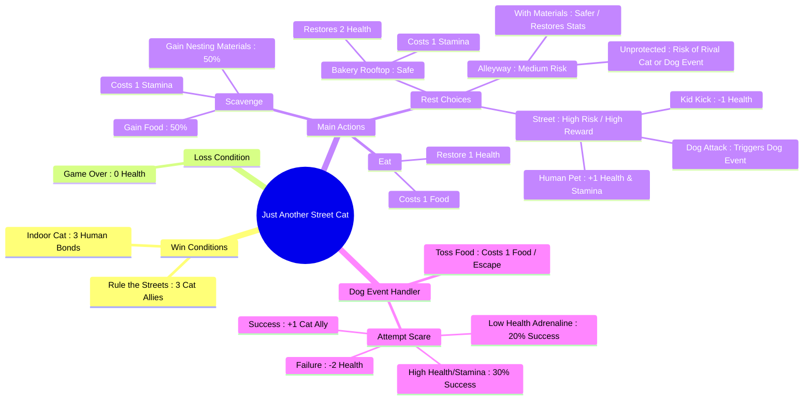

# 🐾 Just Another Street Cat

A text-based CLI survival adventure built with Node.js. Navigate the inner city, manage your resources, and survive long enough to rule the streets or find a home.

## Game Overview & Systems



## How to Run

```bash
node index.js
```