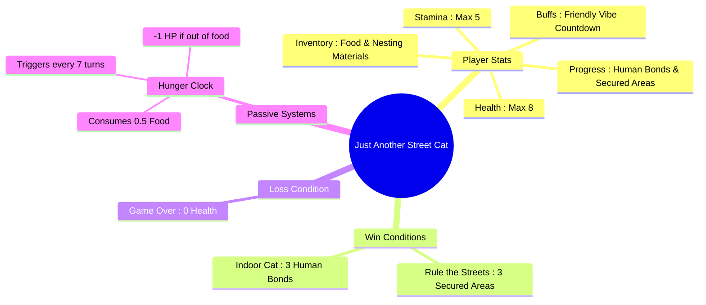

# 🐾 Just Another Street Cat

A text-based CLI survival adventure built with Node.js. Navigate the inner city, manage your resources, and survive long enough to rule the streets or find a home.

---

## 🎮 Game Architecture & Stats



---
## Core Systems & Mechanics
**Hunger Clock**: Every 7 turns, you consume 0.5 food. If your food is empty, you lose 1 Health.

**Friendly Vibe**: Walking away peacefully after feeding a dog triggers a temporary countdown that boosts your chances of positive human interactions (petting).

## Primary Actions
**Scavenge**: Costs 1 Stamina. Rolls independently for food and nesting materials.

**Walk the Street**: Costs 1 Stamina. Can result in a mean kid attack (-1 HP), a kind human petting (+1 HP, +1 Stamina, builds Human Bond), a peaceful walk, or trigger a stray dog encounter.

**Eat**: Consumes 1 Food to restore 1 Health (if below max). Resets the hunger clock.

## 😴 Rest Locations
**Alleyway Rest (Medium Risk)**:
- **With Nesting Materials**: Costs 1 material. Protects against dog encounters; low risk of a rival cat stealing food. Successful rest grants **+2 Stamina** and **+1 Health**.
- **Unprotected**: Risk of stray dog encounters or rival cat attacks (**-1 HP**, steals food). Interrupted rests grant **+1 Stamina**; peaceful rests grant **+2 Stamina**.

**Bakery Rooftop (Safe)**:
- Requires at least 1 Stamina to climb. Costs **1 Stamina** and grants **+1 Health**.

## 🐕 Dog Encounters
When confronted by a stray dog, you can handle the situation in two ways:

- **Toss 1 Food (Distraction)**:
  - *Leave in peace*: Grants a 5-turn **Friendly Vibe** buff, boosting human petting chances.
  - *Attack the distracted dog*: High risk/reward. Success yields **+0.5 Food** and **+1 Scent Mark**; failure results in a **-2 HP** bite.

- **Attempt to Scare**:
  - Success scales dynamically based on Health and Stamina.
  - Success grants **+1 Scent Mark** (triggers an **Adrenaline Surge** guarantee if Health <= 2); failure results in **-2 HP**.


## 🏆 Win & Loss Conditions

### 👑 Victory: Rule the Streets
* Secure **3 Areas** by accumulating 3 Scent Marks per area through intimidation or tactical dog/alley encounters.

### 🏠 Victory: Indoor Cat
* Reach **3 Human Bonds** by being petted multiple times until a human takes you off the streets. **3 pettings = 1 human bond**.

### 💀 Defeat: Game Over
* Your **Health drops to 0** from hunger, hostile cats, kids, or dog attacks.

---

## ⚙️ Configuration & AI Providers

The game uses a local proxy server (`server.js`) to generate your post-game memoir via AI. You can configure your preferred provider by editing the `PROVIDER` variable at the top of `server.js`:

### 1. OpenRouter (Default)
* Set `const PROVIDER = 'openrouter';` in `server.js`.
* Add your API key to a `.env` file:
  ```env
  OPENROUTER_API_KEY=your_key_here
  ```

### 2. Groq
* Set `const PROVIDER = 'groq';` in `server.js`.
* Add your API key to a `.env` file:
  ```env
  GROQ_API_KEY=your_key_here
  ```

### 3. Local Model (e.g., Ollama)
* Ensure your local instance is running (e.g., Ollama running on `http://localhost:11434`).
* Set `const PROVIDER = 'local';` in `server.js`. No API key required!

---

## 🚀 How to Run

1. Start the proxy server for post-game AI summaries:
```bash
node server.js
```

2. In a separate terminal window, start the game:
```bash
node game.js
```