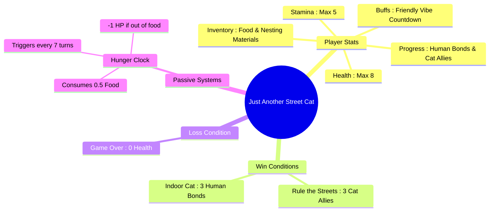

# 🐾 Just Another Street Cat

A text-based CLI survival adventure built with Node.js. Navigate the inner city, manage your resources, and survive long enough to rule the streets or find a home.

---

## 🎮 Game Architecture & Stats



---
## Core Systems & Mechanics
**Hunger Clock**: Every 7 turns, you consume 0.5 food. If your food is empty, you lose 1 Health.

**Friendly Vibe**: Walking away peacefully after feeding a dog triggers a temporary countdown that boosts your chances of positive human interactions (petting).

## Primary Actions
**Scavenge**: Costs 1 Stamina. Rolls independently for food and nesting materials.

**Walk the Street**: Costs 1 Stamina. Can result in a mean kid attack (-1 HP), a kind human petting (+1 HP, +1 Stamina, builds Human Bond), a peaceful walk, or trigger a stray dog encounter.

**Eat**: Consumes 1 Food to restore 1 Health (if below max). Resets the hunger clock.

## 😴 Rest Locations
**Alleyway Rest (Medium Risk)**:

- With Nesting Materials: Costs 1 material. Protects you from dog attacks; low risk of a rival cat stealing food. Success grants +2 Stamina and +1 Health.

- Unprotected: Risk of rival cat attacks (stealing food/stealth-peeing) or dog encounters. Peaceful rests grant +2 Stamina.

**Bakery Rooftop (Safe)**:

- Costs 1 Stamina and grants 1 Health. Requires at least 1 Stamina to climb.

## 🐕 Dog Encounters
When confronted by a stray dog, you can handle the situation in two ways:

- Toss 1 Food (Distraction):
    - Leave in peace: Grants a 5-turn Friendly Vibe boost to human petting chances.
    - Attack the distracted dog: High risk/reward. Successful attacks yield +0.5 Food and +1 Cat Ally; failures result in a -2 Health bite.
- Attempt to Scare:
    - Uses a dynamic success chance based on your current health, stamina, and existing cat allies. Success grants +1 Cat Ally (with an adrenaline surge if your health is $\le$ 2); failure results in -2 Health.

## How to run
```bash
node index.js
```